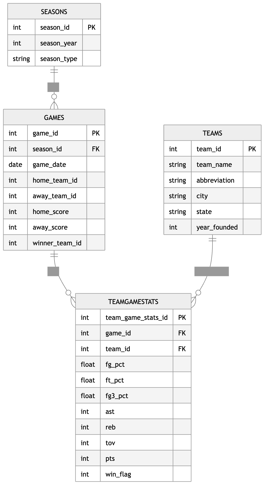

# DS 4320 Project 1: NBA Team Performance Analysis and Win Prediction

### Executive Summary
This repository presents a data science project focused on analyzing NBA team performance and predicting game outcomes using team-level statistics. The project includes data collected and structured into a relational format, along with a complete analysis pipeline built using Python, SQL, and Markdown. The workflow covers data acquisition, preparation, querying with DuckDB, and implementation of a predictive model to identify key factors associated with winning games. Supporting materials such as a data dictionary, schema, background research, and a press release are also included to provide context and ensure transparency, reproducibility, and accessibility for both technical and non-technical audiences.

### Project Information

| Spec           | Value |
|----------------|-------|
| Name           | Leah Kim |
| NetID          | sxk2eh |
| DOI            | [https://doi.org/10.5281/zenodo.19325264](https://doi.org/10.5281/zenodo.19325264) |
| Press Release  | [Can Data Predict the Winner? A Smarter Way for Fans to Estimate NBA Win Probability](press-release/press_release.md)  |
| Data           | [Link to data folder](https://myuva-my.sharepoint.com/:f:/g/personal/sxk2eh_virginia_edu/IgAsD5kURxZAQrhBUOhVSO1TAUpJ-jHaiOW6kVrLLTkeywg?e=nCollH) |
| Pipeline       | [data_creation.ipynb](https://github.com/leahhkim/project1-sports-outcomes/blob/main/data_creation/data_creation.ipynb), [data_creation.py](https://github.com/leahhkim/project1-sports-outcomes/blob/main/data_creation/data_creation.py), [data_creation.md](https://github.com/leahhkim/project1-sports-outcomes/blob/main/data_creation/data_creation.md)
 | License        | [MIT](LICENSE) |

## Problem Definition
### General and Specific Problem
* **General Problem:** "Predicting sports game outcomes."
* **Specific Problem:** "It is hard to tell which team is more likely to win before a game begins, and I want to explore how past performance statistics can help predict game outcomes and try to find a win probability score which can show how likely a team is to win a game."

### Rationale
I refined the general problem by focusing on a team's win probability score before a game begins. Predicting sports results can be difficult, no matter how much past performance data is available. Instead of only predicting whether a team will win or lose, a win probability score provides a more useful way to measure how likely a team is to win based on historical statistics. This metric will hopefully reflect the uncertainty of sports games while still allowing past performance factors, be analyzed to better understand which team may have an advantage.

### Motivation
The project is motivated by the idea that sports games are often difficult to predict before they happen, even when a lot of information about the teams are available. This is important because teams, analysts, and fans, all want to better understand which factors might increase a team's chances of winning. The motivation is to help these groups and by looking at past performance statistics, this project explores whether patterns in historical data can help predict game outcomes more clearly. The goal is to create a win probability score that gives a more useful measure of how likely a team is to win, rather than just labeling the game as a win or loss.

### Press Release Headline and Link (click to view)
[Can Data Predict the Winner? A Smarter Way for Fans to Estimate NBA Win Probability](press-release/press_release.md) 

## Domain Exposition

### Terminology

| Term | Meaning | Why it Matters |
|---|---|---|
| Win Probability Score | A value that shows how likely a team is to win a game. | This is the main metric of the project because it gives a more detailed prediction than just win or loss. |
| Home Team Advantage | The idea that the home team may have a better chance of winning because they are playing on their own court. | This can be an important factor when predicting game outcomes. |
| Team Win Percentage | The proportion of games a team has won out of all games played. | This helps measure overall team strength and past performance. |
| Points Per Game (PPG) | The average number of points a team scores per game. | This shows offensive strength and may help explain a team’s chance of winning. |
| Rebounds / Assists | Rebounds measure how often a team gains possession after a missed shot, while assists measure passes that directly lead to a score. | These statistics help describe team performance beyond just total points scored. |

### Domain
This project lives in the domain of sports analytics and predictive modeling. Sports analytics uses historical game and team performance data to better understand patterns in competition and support decision-making. In this project, past NBA game results, team rankings, and player statistics are used to explore which factors may influence the outcome of a game. It also connects to data-driven forecasting, since the goal isto estimate a team's chance of winning before the game begins.

### Background Reading

[Link to Background Readings](https://drive.google.com/drive/folders/1WxjkUfuYz4fxsjhXomoav8JjU9VPI8D0?usp=sharing)

### Readings Summary

| Title | Brief Description | Link to File |
|---|---|---|
| Introduction to Oliver’s Four Factors | Explains the four key factors that influence basketball success: shooting efficiency, turnovers, rebounding, and free throws. These metrics are widely used in basketball analytics and help explain which statistics are important when predicting game outcomes. | [Open file](https://drive.google.com/file/d/1c7rQsmionXJe8h1elbX1maftxi6zNQmL/view?usp=drive_link) |
| Predicting the Outcome of NBA Games | Discusses statistical and machine learning approaches used to predict NBA game results using historical game data. This helps provide background on how past performance statistics can be used to model win probability. | [Open file](https://drive.google.com/file/d/1V-LcuDNfcShLB-RsMAJNwNsZlVaCDFpZ/view?usp=drive_link) |
| Predictive Analysis of NBA Game Outcomes through Machine Learning | Describes how machine learning models can be applied to NBA datasets to predict game outcomes and identify important predictive features. This reading helps connect the project to predictive modeling methods used in sports analytics. | [Open file](https://drive.google.com/file/d/1lvkuY0EsqdE4XByg8_mG119dFUMKTqse/view?usp=drive_link) |
| Integration of Machine Learning XGBoost and SHAP Models for NBA Game Outcome Prediction | Examines how advanced machine learning models can identify which game statistics have the strongest impact on predicting NBA wins and losses. It helps explain which variables may be important for building a win probability score. | [Open file](https://drive.google.com/file/d/1wWRTCSpblBgSsCU2fUlyXI1QlVUbeQuB/view?usp=drive_link) |
| Machine Learning for Basketball Game Outcomes | Provides an overview of different machine learning techniques used to analyze basketball data and predict game outcomes. This source helps show how predictive analytics is used in sports analytics research. | [Open file](https://drive.google.com/file/d/13Ra81jCVbFb_L8pryX9TZQL12gJiMZpV/view?usp=drive_link) |

## Data Creation
### Raw Data Acquisition Process

To create the dataset for this project, I used a publicly available dataset from Kaggle titled “Basketball Dataset” by Wyatt Owalsh. This dataset contains historical basketball game data, including team performance statistics, game results, and other relevant variables that can be used to analyze and predict game outcomes. I selected this dataset because it provides structured historical data that aligns with my goal of estimating win probability based on past performance. I downloaded the dataset directly from Kaggle as a collection of CSV files and examined the available tables to determine which ones were most relevant to my problem. Since my goal is to predict game outcomes and estimate win probability before a game begins, I focused on variables related to team performance and game results. I selected and used the tables that include game-level results and team statistics, which can be used to construct features representing past performance. The dataset was then loaded into my analysis environment for further processing and modeling, and it serves as the raw input for my project, with its provenance being a publicly available extract from Kaggle that compiles historical basketball data for analytical use.

### Code to Create Data

| File | Brief Description | Link |
|---|---|---|
| `data_creation/data_creation.ipynb` | Jupyter notebook used to explore the raw NBA data, inspect available tables, and develop the data creation pipeline before converting it into a structured script. | [data_creation.ipynb](https://github.com/leahhkim/project1-sports-outcomes/blob/main/data_creation/data_creation.ipynb) |
| `data_creation/data_creation.md` | Markdown version of the data creation notebook that documents the full pipeline in a clean, readable format without requiring execution. | [data_creation.md](https://github.com/leahhkim/project1-sports-outcomes/blob/main/data_creation/data_creation.md) |
| `data_creation/data_creation.py` | Python script used to clean, transform, and construct the final relational dataset (teams, seasons, games, and team_game_stats) from the raw data in a reproducible pipeline. | [data_creation.py](https://github.com/leahhkim/project1-sports-outcomes/blob/main/data_creation/data_creation.py) |
| `data_creation/schema.sql` | SQL file defining the relational structure of the project dataset, including the tables and keys used to organize the data. | [schema.sql](https://github.com/leahhkim/project1-sports-outcomes/blob/main/data_creation/schema.sql) |

### Bias Identification

Bias in this dataset could be introduced through the way the data was originally collected and compiled. The Kaggle basketball dataset aggregates historical game and team statistics from official sources, but it depends on how those sources record and report data. For example, inconsistencies in data entry, missing records, or differences in how statistics are tracked across seasons or teams could introduce bias. Additionally, the dataset may reflect selection bias if certain leagues, seasons, or types of games are included more heavily than others, which could make the data less representative of all basketball games. Since the dataset is a secondary compilation rather than raw observational data, it also inherits any biases present in the original data sources and the decisions made by the dataset creator when organizing and publishing the data.

### Bias Mitigation

Bias in this dataset can be handled by carefully checking and preparing the data before analysis. Missing or inconsistent values can be identified and either corrected or removed to reduce errors. To address potential selection bias across seasons or teams, the data can be filtered or balanced so that no specific time period or group is overrepresented. Bias can also be assessed by comparing results across different subsets of the data, such as different seasons or teams, to see if conclusions remain consistent. Additionally, clearly documenting assumptions and limitations helps account for any remaining bias when interpreting the results of the model.

### Rationale for Critical Decisions

Several important decisions were made when creating and preparing the dataset that could introduce or mitigate uncertainty. First, I selected the Kaggle basketball dataset and chose to focus on game-level results and team performance statistics, since these variables are most relevant for predicting win probability. This involved deciding which tables and features to include, which may introduce uncertainty because excluding certain variables (such as player-level data or advanced metrics) could limit the model’s ability to capture all factors influencing game outcomes. Another key decision was how to structure the data into a relational format, including how to define tables and relationships between games, teams, and statistics. These design choices can affect how easily patterns are captured and may influence results. Additionally, I made decisions about handling missing or inconsistent data, such as whether to remove incomplete records or fill in missing values, which can also introduce uncertainty. To mitigate these effects, I focused on using consistent data preparation methods, selecting broadly relevant features, and documenting all assumptions so that the impact of these decisions is transparent and reproducible.

## Metadata

### Schema

### Data Tables

| Table Name     | Description                                                               | CSV File | Parquet File |
|----------------|---------------------------------------------------------------------------|----------|--------------|
| Seasons        | Season-level dataset containing year and season type used to group games | [seasons.csv](https://myuva-my.sharepoint.com/:x:/g/personal/sxk2eh_virginia_edu/IQCvh94ACevKQpvwVp2gljsZAdfuFdMtmReWYNJb3mdeH9E?e=OWRyzf) | [seasons.parquet](https://myuva-my.sharepoint.com/:u:/g/personal/sxk2eh_virginia_edu/IQASWgMk0a7vS7CeoKvUfMMWAeTh_xAaGdwoR-TFp5Yae9g?e=7hEj0o) |
| Teams          | Team-level dataset containing team identifiers and attributes            | [teams.csv](https://myuva-my.sharepoint.com/:x:/g/personal/sxk2eh_virginia_edu/IQCa2tyVuUFoR6ciJRL6vZ5fATRUhq1LqcrnKn_hxkvL3C0?e=IhNEUm) | [teams.parquet](https://myuva-my.sharepoint.com/:u:/g/personal/sxk2eh_virginia_edu/IQCIJVBiTqUvSoveRGBEAHJ8AVGj9Kkx1L5lpSAoG7islAk?e=1sLJPw) |
| Games          | Game-level dataset containing matchups, scores, and outcomes             | [games.csv](https://myuva-my.sharepoint.com/:x:/g/personal/sxk2eh_virginia_edu/IQAwYIFU75vURYO2R_1w8XskAXT5ZgGMVymd3K9Xi1UE5Hs?e=4uZfwB) | [games.parquet](https://myuva-my.sharepoint.com/:u:/g/personal/sxk2eh_virginia_edu/IQDO1aXXpZstToSdx7lloDffAQ2YsPZickyRp6OLG0TSoR0?e=0ysPVA) |
| TeamGameStats  | Dataset containing team performance statistics for each game             | [team_game_stats.csv](https://myuva-my.sharepoint.com/:x:/g/personal/sxk2eh_virginia_edu/IQC1HUarcvtoQaOXypyL-7BsAVeqM3Cj6_XNsCSVxg4j3I0?e=tnVeks) | [team_game_stats.parquet](https://myuva-my.sharepoint.com/:u:/g/personal/sxk2eh_virginia_edu/IQCf3omeyv9kRKlA4yuHS7E8AUzKac37ojDkZwSvDw6ECqw?e=kw6xke) |

### Data Dictionary

#### Seasons

| Feature Name | Data Type | Description | Example |
|-------------|----------|-------------|--------|
| season_id | Integer | Unique identifier for each season | 2021 |
| season_year | Integer | Year of the season | 2021 |
| season_type | String | Type of season (e.g., regular, playoffs) | Regular |

---

#### Teams

| Feature Name | Data Type | Description | Example |
|-------------|----------|-------------|--------|
| team_id | Integer | Unique identifier for each team | 1610612737 |
| team_name | String | Full name of the team | Atlanta Hawks |
| abbreviation | String | Short team abbreviation | ATL |
| nickname | String | Team nickname | Hawks |
| city | String | City where the team is based | Atlanta |
| state | String | State where the team is located | Georgia |
| year_founded | Integer | Year the team was founded | 1946 |
---

#### Games

| Feature Name | Data Type | Description | Example |
|-------------|----------|-------------|--------|
| game_id | Integer | Unique identifier for each game | 0022100001 |
| season_id | Integer | Foreign key linking to Seasons table | 2021 |
| game_date | Date | Date the game was played | 2021-10-19 |
| home_team_id | Integer | ID of the home team | 1610612737 |
| away_team_id | Integer | ID of the away team | 1610612747 |
| home_score | Integer | Points scored by the home team | 112 |
| away_score | Integer | Points scored by the away team | 105 |
| winner_team_id | Integer | ID of the team that won the game | 1610612737 |

---

#### TeamGameStats

| Feature Name        | Data Type        | Description                                              | Example      |
|--------------------|------------------|----------------------------------------------------------|--------------|
| team_game_stats_id | Integer          | Unique identifier for each team-game record              | 1            |
| game_id            | Integer          | Foreign key linking to Games table                       | 0022100001   |
| team_id            | Integer          | Foreign key linking to Teams table                       | 1610612737   |
| fg_pct             | Float            | Field goal percentage                                    | 0.47         |
| ft_pct             | Float            | Free throw percentage                                    | 0.82         |
| fg3_pct            | Float            | Three-point percentage                                   | 0.36         |
| ast                | Integer          | Number of assists                                        | 25           |
| reb                | Integer          | Number of rebounds                                       | 48           |
| tov                | Integer          | Number of turnovers                                      | 12           |
| pts                | Integer          | Total points scored                                      | 112          |
| win_flag           | Integer (0/1)    | Indicates whether the team won the game (1 = win, 0 = loss) | 1         |

### Data Dictionary Quantification of Uncertainty

| Feature Name | Source of Uncertainty | How Uncertainty Can Be Quantified |
|---|---|---|
| home_score | Recording errors or inconsistencies across historical data tables | Compute the mismatch rate between `home_score` and the corresponding home total in related tables: `(# inconsistent games) / (# total games)`. Also report the absolute difference when mismatches occur. |
| away_score | Recording errors or inconsistencies across historical data tables | Compute the mismatch rate between `away_score` and the away total recorded in related tables. Use mean absolute difference (MAD) or maximum absolute difference across sources to quantify disagreement. |
| FG_PCT | Rounding error and instability from small numbers of shot attempts | Quantify uncertainty using the standard deviation of `FG_PCT` across games and a binomial standard error: `sqrt(p(1-p)/n)`, where `p` is field goal percentage and `n` is field goal attempts. Smaller `n` implies higher uncertainty. |
| FT_PCT | Rounding error and instability from low free throw attempt counts | Measure uncertainty with the standard deviation across games and the binomial standard error: `sqrt(p(1-p)/n)`, where `n` is free throw attempts. This gives a numeric estimate of how unreliable the percentage is when attempts are low. |
| FG3_PCT | High variability because some teams attempt very few three-point shots | Quantify with the standard deviation across games and the binomial standard error using three-point attempts as `n`: `sqrt(p(1-p)/n)`. You can also compare the coefficient of variation (CV) across seasons or teams. |
| AST | Possible inconsistencies in how assists are recorded | Measure uncertainty using the standard deviation of assists across similar teams or games and detect anomalies with z-scores: `(x - mean) / std`. Large absolute z-scores indicate unusually uncertain or inconsistent values. |
| REB | Minor recording inconsistencies or classification differences | Quantify with standard deviation, interquartile range (IQR), and outlier counts based on the `1.5 * IQR` rule. These numeric measures show how much rebound values vary and whether unusual entries exist. |
| TOV | Data entry inconsistencies or recording differences | Use standard deviation, IQR, and z-scores to identify unusually high or low turnover values. The proportion of outliers can serve as a numeric uncertainty indicator. |
| PTS | Derived from underlying scoring events, so aggregation mistakes are possible | Quantify by recalculating points from box score components and computing the error rate: `(# games where recalculated points != recorded points) / (# total games)`. Also report the mean absolute difference between recorded and reconstructed points. |
| win_flag | Derived from game outcome, so errors in score variables propagate here | Quantify uncertainty by recomputing `win_flag` from `home_score` and `away_score` and calculating the disagreement rate: `(# incorrect win flags) / (# total games)`. Ideally this should be `0%`. |

