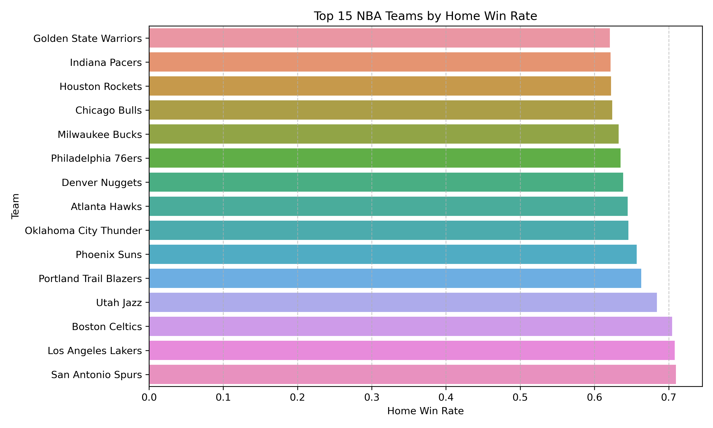

# Can Data Predict the Winner? A Smarter Way for Fans to Estimate NBA Win Probability

## If you have ever looked at two NBA teams before tipoff and wondered who really has the better chance to win, you are not alone. Fans, fantasy players, and sports analysts often rely on instinct, headlines, or a few basic stats, but those do not always tell the full story. This project is designed for people who want a clearer, data-driven way to estimate a team’s chance of winning before the game begins.

## Problem Statement

For sports fans and analysts, predicting the outcome of a game before it starts is challenging. There is a huge amount of NBA data available, but it is not always obvious which numbers matter most or how to turn them into something useful. Looking at wins and losses alone does not explain why one team may have the edge over another. This project focuses on that problem by exploring whether historical NBA team performance statistics can be used to estimate a win probability score, giving users a more informed way to judge a team’s chances before a game.

## Solution Description

This project uses historical NBA game data to identify patterns in team performance that are linked to winning. By analyzing statistics such as shooting percentages, assists, rebounds, and turnovers, the model estimates the probability that a team will win. This means turning raw sports data into a simple, understandable score that can support pregame comparisons and more informed decision making. Rather than replacing human judgment, the goal is to give fans and analysts a practical tool that helps them evaluate matchups with more confidence.

## Chart

This chart visualizes the home win rate for NBA teams based on historical game results. The results show a noticeable but relatively modest variation in home win rates, with most teams falling within a similar range.

This supports the solution by demonstrating that historical performance data contains meaningful patterns, such as home court advantage, that can contribute to estimating a team’s probability of winning. While the differences are not extreme, they indicate that certain factors consistently influence outcomes and can be incorporated into a predictive model.

